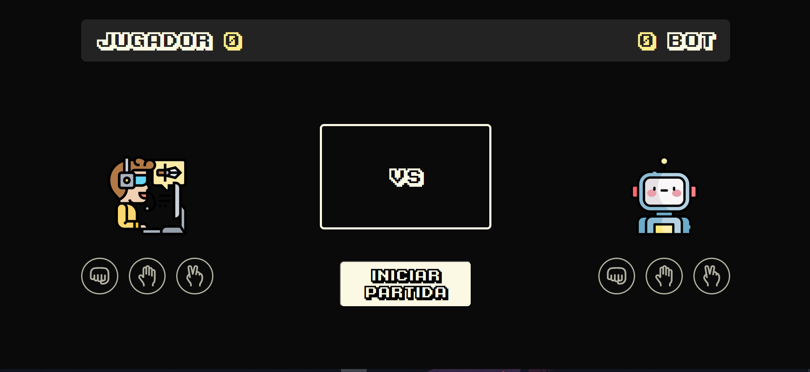

# Juego-Piedra-Papel-Tijera
Este es un pequeño proyecto hecho con **HTML**, **CSS** y **JavaScript** como parte de mi aprendizaje en *The Odin Project*.  
El objetivo principal fue poner en práctica **manipulación del DOM**, **eventos**, **control de flujo** y **estructuración de funciones**.

---

## 🎯 Funcionalidades
- Juego clásico de Piedra, Papel o Tijeras contra la computadora.
- Marcador en tiempo real con cambio de color según quién va ganando:
  - 🟢 Verde → Jugador o Bot que va ganando.
  - 🔴 Rojo → Jugador o Bot que va perdiendo.
  - 🟡 Amarillo → Empate.
- Animaciones temporales para mostrar las jugadas y mensajes de cada ronda.
- Posibilidad de reiniciar la partida al terminar.
- Límite de rondas configurado a 5 por partida.

---

## 🖼 Vista previa

